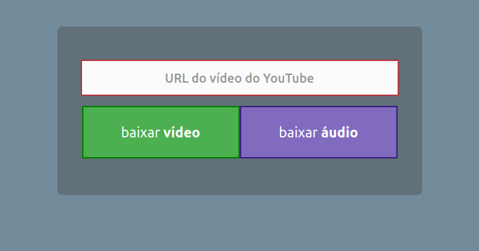

# youtube-downloader



## Usage

> requirements: [Nodejs](https://nodejs.org)

After downloading this project source, run the following commands:

```bash
npm install --prod
npm start
```

And visit http://localhost:8080

### For Linux users

Add a `/etc/hosts` entry like the following:

```
127.0.0.2 ytd.com
```

Then you add an iptables rule to redirect the traffic incoming into `127.0.0.2:8080` to `127.0.0.1:80`:

```bash
iptables -t nat -A OUTPUT -d 127.0.0.2 -p tcp --dport 80 -j REDIRECT --to-port 8080
```

Now you can access the app in your browser through http://ytd.com or  
in your network through `http://<your IP>:8080` address

### or, using [Docker](https://docs.docker.com)

```bash
# After downloading this project source

docker build --tag yt-downloader:latest

docker run --detach                     \
  --restart=always                      \
  --name "yt"                           \
  --memory 4G --memory-reservation=256m \
  --publish '0.0.0.0:4444:8080'         \
  yt-downloader
```

And visit http://localhost:4444

## Development usage

Run:

```bash
npm install
export PORT=4444
npm run dev
```

And go to http://localhost:4444

Every change in `*.js` files will reload the server.

### or, using `docker-compose` 

> Doing a [pure-Docker development](https://www.docker.com/blog/keep-nodejs-rockin-in-docker)

```bash
export PORT=8080
npm run up
npm run logs

## Open the entry file `app.js` in your favorite text editor.
## Changes will reload the server that is running inside Docker container.

# In another shell session:
export PORT=8080
## to install dependencies in the up running container
npm run c:npm install <dependency name ...>
## to remove dependencies
npm run c:npm uninstall <dependency name ...>
```

